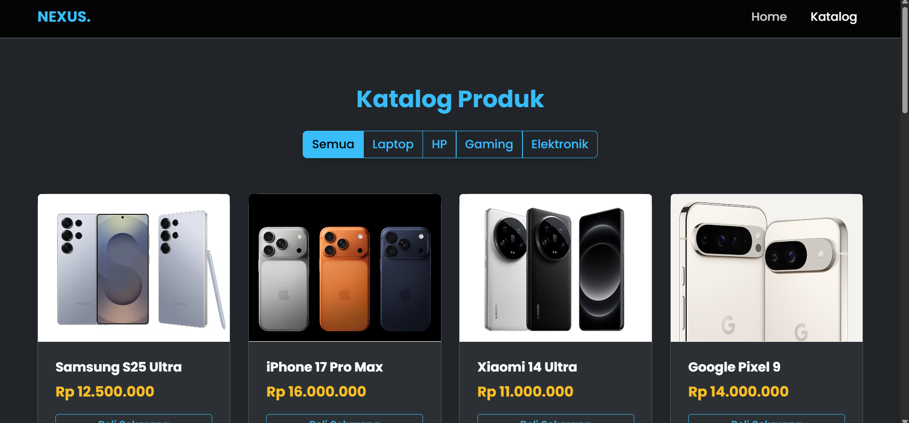
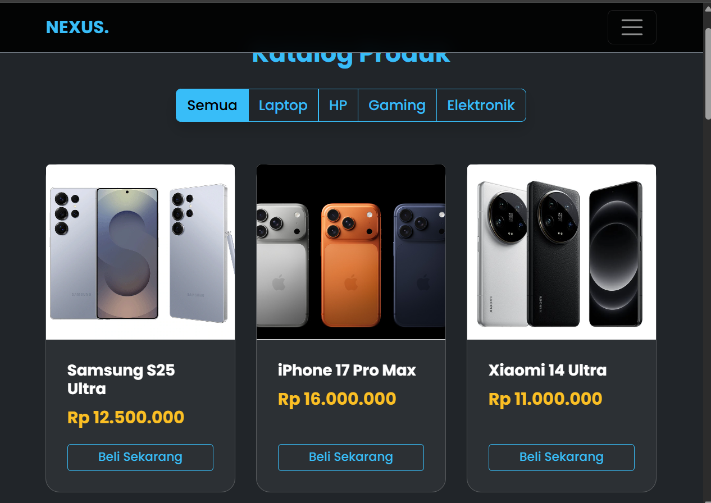
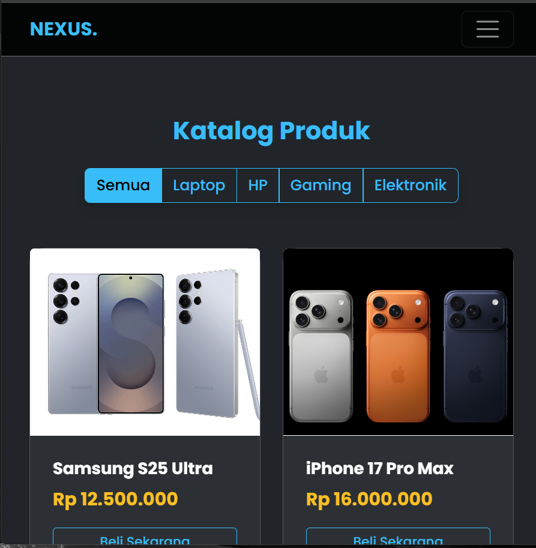

# Laporan Tugas Besar: Pengembangan Website Nexus Store

## 1. Identitas Proyek
* **Nama Website:** Nexus Store
* **Topik:** E-Commerce Gadget & Elektronik (High-Fidelity)
* **Deskripsi:** Nexus Store adalah platform e-commerce berbasis web yang dirancang untuk memberikan pengalaman belanja gadget yang modern, responsif, dan inklusif. Website ini menerapkan konsep desain *Glassmorphism* (Dark Mode) yang elegan, dengan fokus pada kemudahan navigasi pengguna (User Experience).

### Anggota Kelompok:
1. **Muhammad Arya Alqadi** (4524210058)
2. **Muhamamad Arkan** (4524210114)
3. **Rangga Veda Aswanga** (4524210118)
4. **Muhammad Jibran Ferdian** (4524210067)
5. **Muhammad Farel Alberto** (4524210061)
6. **Aufa Al Ghiyats Sulthan Priatmojo** (4524210132)

---

## 2. Teknologi & Tools
Kami menggunakan *Tech Stack* modern standar industri front-end:

| Teknologi | Penggunaan & Alasan |
| :--- | :--- |
| **HTML5** | Menggunakan *Semantic Tags* (`<main>`, `<nav>`, `<header>`, `<footer>`) untuk struktur dokumen yang rapi dan SEO-friendly. |
| **CSS3** | Styling kustom untuk efek *Glassmorphism* (`backdrop-filter`), animasi transisi, dan tipografi modern. |
| **Bootstrap 5.3** | Framework utama untuk sistem Grid Responsif, komponen Modal, dan utilitas layout. |
| **JavaScript (ES6)** | Menangani logika interaktif seperti Filter Kategori, Pop-up Modal, dan Scroll Event tanpa reload halaman. |
| **FontAwesome 6** | Menyediakan ikon vektor untuk memperjelas informasi visual (UI Icons). |
| **Google Fonts** | Menggunakan font *Poppins* untuk keterbacaan yang tinggi dan tampilan modern. |

---

## 3. Fitur Unggulan

### A. Katalog Produk Interaktif (Dynamic Filter)
Fitur ini memungkinkan pengguna menyaring produk berdasarkan kategori (Laptop, HP, Gaming) tanpa perlu *reload* halaman.
* **Teknis:** Menggunakan JavaScript DOM Manipulation untuk memfilter atribut `data-kat`.

### B. Product Quick View (Modal Pop-up)
Pengguna dapat melihat detail produk, foto ukuran besar, dan spesifikasi tanpa meninggalkan halaman katalog.
* **Teknis:** Menggunakan *Bootstrap Modal* dengan *Data Injection* via JavaScript.

### C. Direct Booking via WhatsApp
Tombol "Beli Sekarang" terintegrasi langsung dengan API WhatsApp.
* **Otomatisasi:** Sistem otomatis membuat pesan: *"Halo Admin Nexus Store, saya tertarik membeli [Nama Produk]..."* sehingga pengguna tidak perlu mengetik manual.

### D. Desain Responsif (Mobile-First)
[cite_start]Layout website beradaptasi otomatis di berbagai perangkat[cite: 36]:
* **Mobile:** Grid 2 Kolom.
* **Tablet:** Grid 3 Kolom.
* **Desktop:** Grid 4 Kolom.

---

## 4. Struktur Halaman (Sitemap)

1. **Homepage (`index.html`)**
   * *Hero Section:* Video Background iklan gadget.
   * *Featured:* Produk rekomendasi dan keunggulan toko.
2. **Katalog Produk (`produk.html`)**
   * *Filter Bar:* Navigasi kategori produk.
   * *Grid Produk:* Daftar lengkap barang dagangan.
3. **Syarat & Ketentuan (`syarat.html`)**
   * Informasi tata cara pemesanan dan klaim garansi dengan layout kartu.

---

## 5. Bukti Responsivitas (Screenshot)
Berikut adalah bukti bahwa website berfungsi baik di berbagai perangkat:

### Halaman Katalog
| Tampilan Desktop | Tampilan Tablet | Tampilan Mobile |
| :---: | :---: | :---: |
|  |  |  |

---

## 6. Audit Aksesibilitas & Performa

### A. Inklusivitas Warna
Menggunakan skema warna *High Contrast* (Teks Putih di atas Hitam) yang sangat aman untuk mata dan penderita buta warna.
* **Background:** `#050505` (Hitam Pekat)
* **Text:** `#ffffff` (Putih) & `#38bdf8` (Biru Muda)

---

## 7. Manajemen Kode & Link Proyek

Proyek ini dikerjakan menggunakan metode kolaborasi Git Branching:
* **Main Branch:** Kode produksi yang stabil.
* **Feature Branches:** `dev/styling`, `dev/logic-js`, `feature/product-catalog`, `feature/terms-page`.

### Akses Proyek:
* **Link Repository GitHub:** https://github.com/mhmdaryaqadi/project-uas-dw-a-prak.git
* **Link Website Live (Demo):** https://mhmdaryaqadi.github.io/project-uas-dw-a-prak/
